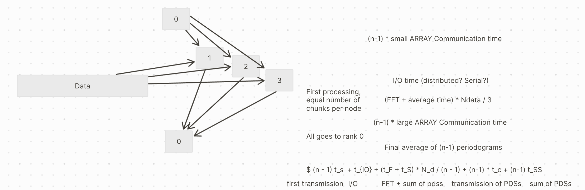
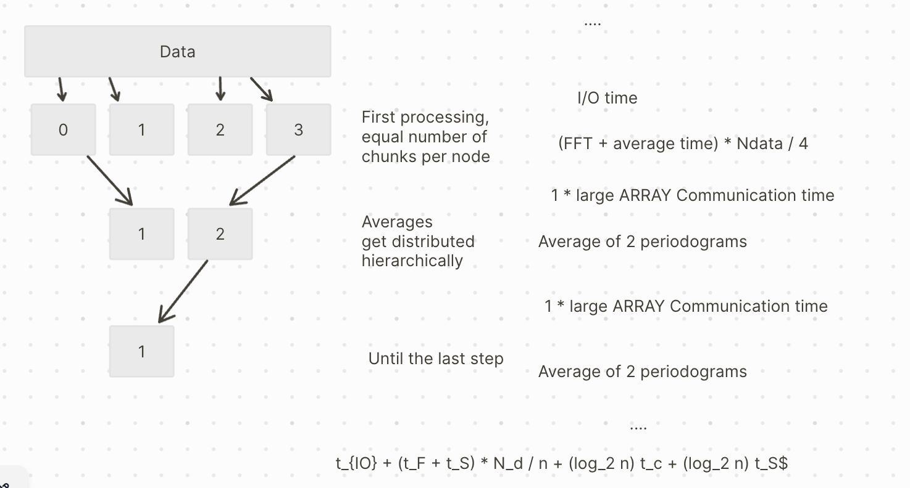

# Proof-of-concept: parallel Stingray

E. V. Lai, M. Bachetti

We implemented a code able to parallelize some functions at the base of
the "Averaged Cross Spectrum" and "Power Spectrum" classes. In
particular, we ported in parallel the light curve's chunks data
processing and averaging. The code we developed and tested is
"parallel_proof_of_concept.py".

The code needed some propedeutic work, which was brought about in ICSC's fork 
of Stingray and finally merged upstream: [PR 834 ](https://github.com/StingraySoftware/stingray/pull/834)

The standard operation we are going to parallelize is a Bartlett periodogram: 1) a time series is
cut in equal time segments; 2) we calculate the FFT of each segment and
take the square modulus (=the periodogram); 3) we average all these
periodograms.

In our example in this directory, data are simulated the first time the code is executed with a given set of parameters. We simulate an observation of length 12800, containing random photons with a count rate of 10 ct/s. For the Bartlett periodogram, we use 128-s segments, with a sampling time of $10^{-14}$\s (for a Nyquist frequency of 8192 Hz).

The serial Stingray algorithm can be executed from the command line as 
```
python parallel_analysis_comparison_fullstingray_sim.py --method none
```
It takes ~45 seconds on our test laptop, a Macbook with 8 "performance" cores + 2 "efficiency" cores.


## First parallel implementation

The first parallel version of this operation that we implemented is
trivial, as follows:



Node 0 tells all the nodes what data they will analyze. Each of the
remaining nodes works on its share of data, calculating periodograms on
all segments of time series it's been assigned and summing them; then,
each node sends its results to Node 0 that makes the final sum and
divides by the number of segments (what we call the final reduce
operation). The final reduce operation is sequential, and requires all
nodes to wait for their turn to transmit the data and for Node 0 to
execute the sum.

## Second parallel implementation

The second parallel implementation, implemented both with MPI and
multiprocessing, improves the first passage: each node knows from the
start, from the properties of the data and the input strategy, what data
it will analyze. The final sum is still done by Node 0

To execute this implementation with multiprocessing, use
```
python parallel_analysis_comparison_fullstingray_sim.py --method multiprocessing
```
It takes ~16 s on our test laptop

## Third parallel implementation
The plot below represents the schematic idea behind a second parallel
implementation, that improves on the first in that the final reduce
operation is done according to a binary tree scheme. Basically, the sums
are done in parallel as well, pairing the nodes. If the transmission
process is really independent, the sum of all results takes *log~2~ n*
steps instead of *n*. Mathematically/statistically no errors are
introduced by the cascade of "averages" we implemented.


To execute this implementation, use a slightly different command (needed to spawn the MPI processes)
```
mpiexec -n 10 python parallel_analysis_comparison_fullstingray_sim.py --method mpi
```
It takes ~13 s on our test laptop


## Results

We tested the implementations on a example - event file, from the NuSTAR
mission (see the folder M9_Lai for the test event file). The test led to a speed up from 50 s (serial) to 14 s with
multi-processing (second parallel implementation) and 12s using MPI
(third implemantation). No transparent calculation implemented at the
moment. The number of chunks is chosen by the user.

We initially explored using JAX for transparent calculation on GPU for
some operations. However, JAX required heavy modifications on the
pre-existing code. We are planning to explore its advantages in the
future, in particular for what concerns the calculation of histograms
which is the second bottleneck after the execution of FFTs.
